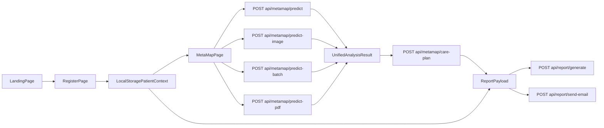

# Code Architecture

## Overview

This repository now contains a single Next.js App Router application that implements a demo patient risk workflow:

1. register a sample patient
2. run one risk analysis from manual inputs or an uploaded source
3. generate a PDF report
4. optionally email the report to the patient

The current implementation is intentionally demo-oriented. It prioritizes a clean end-to-end workflow, shared result contracts, and clear UI states over persistent storage or production-grade clinical modeling.

## Tech Stack

- Framework: Next.js 16 with React 19
- Language: TypeScript with `strict` mode enabled
- Styling: Tailwind CSS 4 plus app-specific CSS utilities in `src/app/globals.css`
- Charts: `recharts`
- PDF parsing: `pdf-parse`
- PDF generation: `pdf-lib`
- Email delivery: `resend`
- Package manager lockfile: npm (`package-lock.json`)

## High-Level Architecture

### Presentation layer

- `src/app/page.tsx`
  - Product overview and workflow entry point.
- `src/app/register/page.tsx`
  - Demo patient registration form.
  - Stores patient context in browser local storage.
- `src/app/metamap/page.tsx`
  - Main analysis workspace.
  - Supports manual inputs plus file uploads for image, CSV, and PDF.
  - Shows risk summary, organ focus, charts, care plan, download, and email actions.

### Reusable UI

- `src/components/site-header.tsx`
  - Shared top navigation and brand shell.
- `src/components/risk-badge.tsx`
  - Shared risk-level badge for result displays.

### Domain and workflow helpers

- `src/lib/patient.ts`
  - Patient registration types.
  - Local storage keys.
  - Patient ID generation.
  - Age calculation and profile normalization.
- `src/lib/metamap/types.ts`
  - Shared analysis and care-plan contracts.
- `src/lib/metamap/analysis.ts`
  - Demo scoring and normalization logic for manual, CSV, image, and PDF flows.
  - Unified `AnalysisResult` creation.
  - Care-plan derivation from risk output.
- `src/lib/report/types.ts`
  - Shared report payload type.
- `src/lib/report/buildPdf.ts`
  - Builds the downloadable/emailable PDF report using `pdf-lib`.

### API layer

- `src/app/api/metamap/predict/route.ts`
  - Manual parameter analysis.
- `src/app/api/metamap/predict-image/route.ts`
  - Image upload analysis using demo heuristics.
- `src/app/api/metamap/predict-batch/route.ts`
  - CSV batch analysis.
- `src/app/api/metamap/predict-pdf/route.ts`
  - PDF text extraction and document analysis.
- `src/app/api/metamap/care-plan/route.ts`
  - Converts an `AnalysisResult` into a structured care plan.
- `src/app/api/report/generate/route.ts`
  - Generates a PDF response from patient + analysis + care plan.
- `src/app/api/report/send-email/route.ts`
  - Generates the PDF and sends it with Resend.
  - Returns simulated success when email configuration is absent.

## Data Flow

## Current Product Behavior

### Registration

- The registration flow is browser-local only.
- There is no database, authentication, or server-side session.
- Patient context survives page navigation in the same browser via local storage.

### Analysis

- Manual input scoring uses numeric demo heuristics.
- Image analysis uses filename and file metadata heuristics in the current implementation.
- CSV analysis parses file text and summarizes dataset-level risk signals.
- PDF analysis extracts text with `pdf-parse` and derives a risk summary from oncology-related language.

### Reporting

- All source types normalize into the same `AnalysisResult` shape.
- Report generation uses a single `ReportPayload` contract.
- The generated PDF includes patient details, risk summary, organ focus, key findings, recommendations, and a fixed disclaimer.

### Email delivery

- If `RESEND_API_KEY` is configured, the app sends the generated PDF to the registered patient email.
- If email is not configured, the API returns a simulated success response so the demo flow remains usable.

## Engineering Decisions

- Shared contracts first:
  - All analysis routes return the same `AnalysisResult` shape to keep the UI and report generation simple.
- Demo-safe fallbacks:
  - External services are optional where possible so the workflow can still run in local development.
- Client persistence only:
  - Registration data stays in local storage because persistent storage is explicitly out of scope for this build.
- Clear UX state handling:
  - The analysis page exposes missing-patient, loading, success, and error states directly in the UI.

## Known Limitations

- This is not a clinical-grade inference system.
- Image prediction is heuristic rather than true medical image modeling.
- PDF analysis is strongest for text-based PDFs and weaker for scanned-image documents.
- Local storage means patient context is browser-specific and easy to clear.
- Email sending is synchronous and suitable for demo scale, not queue-backed production throughput.

## Recommended Next Steps

1. Replace heuristic scoring with validated analysis pipelines if real model assets become available.
2. Add server-side persistence for patients, analyses, and generated reports.
3. Add OCR for scanned PDFs and richer image analysis if clinical imaging becomes a true product path.
4. Move email sending and report generation into background jobs if reliability or scale becomes important.
